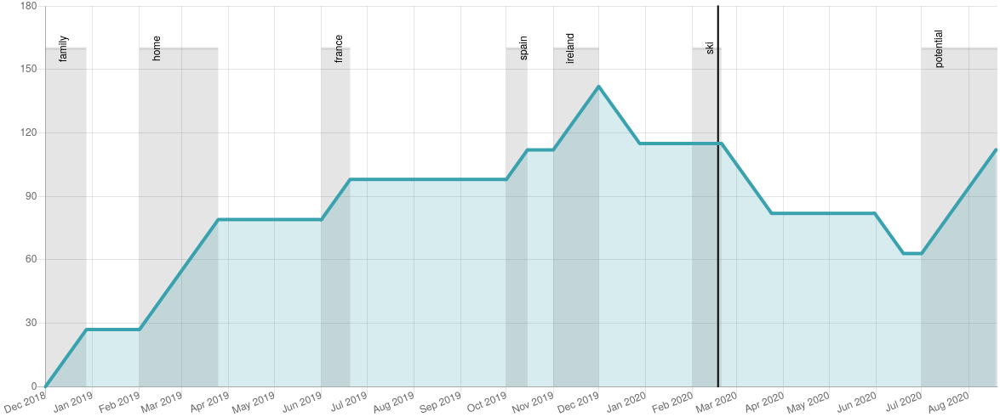

# leave2remain
Calculate whether you meet the continuous presence requirements in the UK

## Usage
Clone this repo:

    git clone https://github.com/carderne/leave2remain.git

Edit the `trips.txt` file with your past and definite future trips using the exact format as the example lines.

Then run the script:

    ./l2r.py

You can also have different 'trips' files and pass them to the program as follows:

    ./l2r.py other.txt

A chart like the one below will appear in a separate window.

